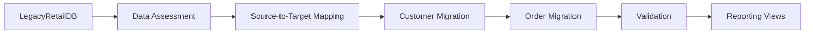

# SQL Server Data Migration & Validation

An end-to-end SQL Server data migration project demonstrating T-SQL, SQL Server Management Studio (SSMS), source-to-target mapping, data cleansing, validation, stored procedures, views, and reusable user-defined functions.

> This project was built as a hands-on learning project to strengthen practical SQL Server and T-SQL data migration skills while following a structured, real-world migration workflow suitable for a Junior Data Engineer portfolio.

---

## Business Scenario

A retail company is migrating customer and order data from a legacy SQL Server database (**LegacyRetailDB**) into a clean reporting database (**RetailReportingDB**).

The legacy system contains:

- Inconsistent data formats
- Missing values
- Duplicate customer records
- Orphan orders
- Dates and monetary values stored as text

The objective is to migrate, clean, validate, and prepare the data for reporting while preserving data integrity.

---

## Technologies Used

- SQL Server
- SQL Server Management Studio (SSMS)
- T-SQL
- Views
- Stored Procedures
- User Defined Functions (UDFs)
- Git & GitHub

---

## Skills Demonstrated

- SQL Server Database Design
- T-SQL Development
- Data Migration
- Source-to-Target Mapping
- Data Cleansing & Standardization
- Data Validation
- Row Count Reconciliation
- Referential Integrity
- Views
- Stored Procedures
- User Defined Functions
- Documentation

---

## Project Structure

```
sql-server-data-migration-validation
│
├── README.md
├── .gitignore
│
├── setup/
│   ├── 01_Create_LegacyRetailDB.sql
│   └── 02_Create_RetailReportingDB.sql
│
├── assessment/
│   └── 03_Legacy_Data_Assessment.sql
│
├── migration/
│   ├── 05_Migrate_Customers.sql
│   └── 06_Migrate_Orders.sql
│
├── validation/
│   └── 07_Migration_Validation.sql
│
├── views/
│   ├── 08_vwCustomerSummary.sql
│   └── 09_vwOrderSummary.sql
│
├── functions/
│   ├── 10_fn_ProperCase.sql
│   └── 11_fn_FormatPhone.sql
│
├── procedures/
│   ├── 12_sp_MigrateCustomers.sql
│   └── 13_sp_MigrateOrders.sql
│
├── docs/
│   ├── Architecture.md
│   ├── Migration_Report.md
│   ├── Lessons_Learned.md
│   └── 04_Source_To_Target_Mapping.md
│
└── screenshots/
```

---

## Migration Workflow



---

## Validation Summary

| Metric | Result |
|---------|--------|
| Customers Migrated | 10 / 10 |
| Orders Migrated | 9 / 10 |
| Rejected Orders | 1 (Expected Orphan Record) |
| Validation Status | ✅ PASS |

---

## Screenshots

### Legacy Database

_Add screenshot_

---

### Customer Migration

_Add screenshot_

---

### Order Migration

_Add screenshot_

---

### Validation Output

_Add screenshot_

---

### Customer Summary View

_Add screenshot_

---

### Order Summary View

_Add screenshot_

---

## Documentation

Detailed project documentation is available in the **docs** folder.

- Architecture.md
- Migration_Report.md
- Lessons_Learned.md
- 04_Source_To_Target_Mapping.md

---

## Future Improvements

- Support incremental data migration
- Add migration audit logging
- Implement SQL Server Agent scheduling
- Extend migration to additional entities such as Products and Inventory

---

## Author

**Dhana Lakshmi Selvamani**

Microsoft Fabric DP-700 Certified Data Engineer

GitHub: https://github.com/Dhanaa07

LinkedIn: *(https://www.linkedin.com/in/dhana-lakshmi-selvamani-1a5935212/)*
