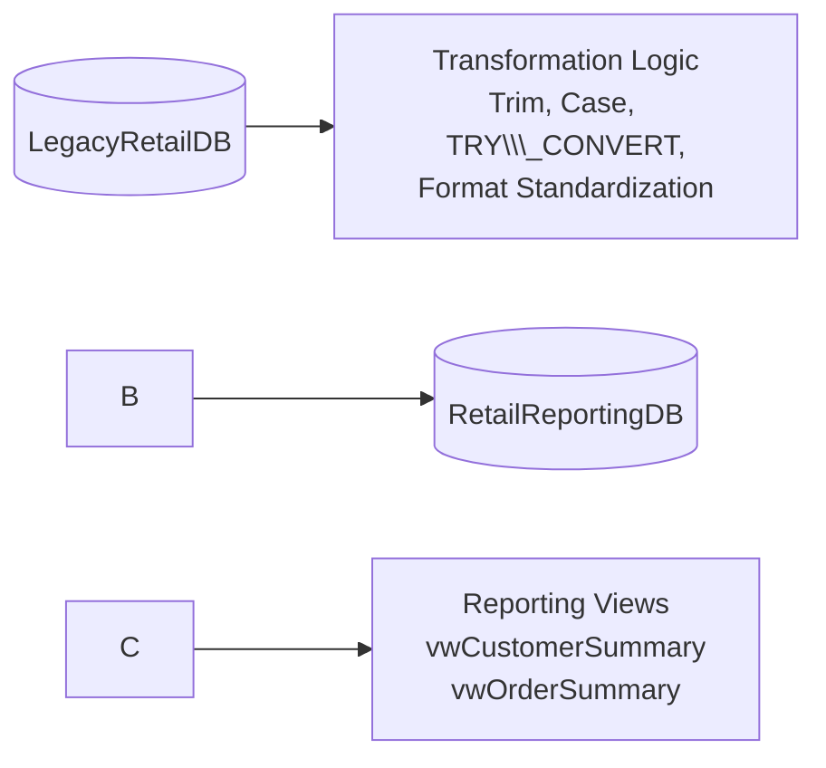
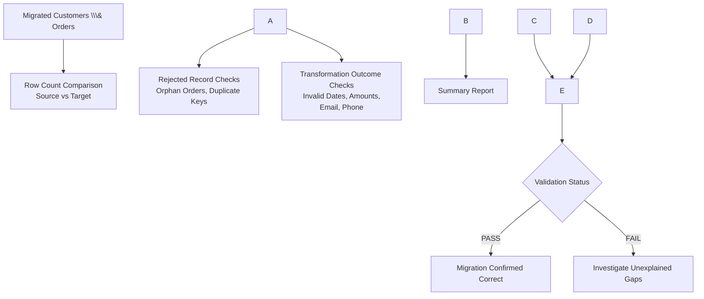
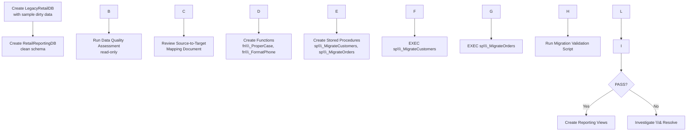
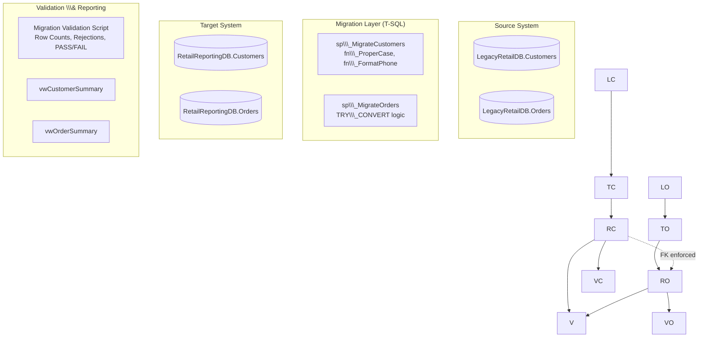

# Architecture

## SQL Server Data Migration \& Validation

\---

## System Overview

This project implements a two-database migration architecture in Microsoft
SQL Server. A legacy source database (`LegacyRetailDB`) containing dirty,
inconsistently formatted customer and order data is transformed and loaded
into a clean, constraint-enforced reporting database (`RetailReportingDB`).

The system is entirely script-driven T-SQL, executed manually in SQL Server
Management Studio (SSMS). It has no external orchestration layer, no ETL
tooling, and no scheduling — migration steps are run in a defined order by
the operator. The architecture favors simplicity and transparency over
automation, making every step easy to inspect, explain, and re-run.

The system is composed of four logical layers:

|Layer|Responsibility|
|-|-|
|Source|Holds raw, unvalidated legacy data (`LegacyRetailDB`)|
|Transformation|Cleansing and standardization logic applied during migration|
|Target|Holds clean, constrained, migrated data (`RetailReportingDB`)|
|Validation \& Reporting|Confirms migration correctness; exposes clean data via views|

\---

## Legacy Database

**Database:** `LegacyRetailDB`

Represents the retail company's old system. Designed intentionally to
reflect real-world legacy data problems.

**Tables:**

|Table|Notes|
|-|-|
|`dbo.Customers`|Names, email, phone, address; no format enforcement|
|`dbo.Orders`|Dates and amounts stored as free-text `VARCHAR`|

**Characteristics:**

* No primary key enforcement beyond a plain `INT` column
* No foreign key between Orders and Customers
* Dates and monetary amounts stored as text, in inconsistent formats
* Mixed casing, leading/trailing spaces, blank strings
* Contains duplicate customer records
* Contains orders referencing non-existent customers (orphan records)

This database is treated as **read-only** throughout the entire migration
process — nothing in the pipeline ever modifies `LegacyRetailDB`.

\---

## Target Database

**Database:** `RetailReportingDB`

Represents the new, clean reporting system that downstream reporting and
analytics will rely on.

**Tables:**

|Table|Notes|
|-|-|
|`dbo.Customers`|Primary key on `CustomerID`; typed columns; `LoadDate` audit column|
|`dbo.Orders`|Primary key on `OrderID`; foreign key to `Customers`; typed `DATE`/`DECIMAL` columns|

**Characteristics:**

* Proper data types: `DATE` for dates, `DECIMAL(10,2)` for monetary amounts
* Enforced primary keys and a foreign key (`Orders.CustomerID → Customers.CustomerID`)
* `LoadDate` columns (default `GETDATE()`) provide basic migration auditability
* Indexes on `Orders.CustomerID` and `Orders.OrderStatus` to support common reporting queries
* Reporting views (`vwCustomerSummary`, `vwOrderSummary`) sit on top of these tables for consumption

Source keys (`CustomerID`, `OrderID`) are preserved exactly as they exist in
the legacy system — no surrogate keys are introduced.

\---

## Data Flow

Data flows in a single direction: legacy → transformation → target. No data
is ever written back to the legacy system.

Each column's transformation is explicitly defined in the
[Source-to-Target Mapping document](docs/04_Source_To_Target_Mapping.md),
which acts as the contract between the source and target schemas.

\---

## Validation Flow

Validation runs as an independent, read-only step **after** migration
completes. It does not participate in the migration itself, which keeps the
validation results an honest, unbiased check on migration correctness.

A result of **FAIL** only occurs when a row is missing from the target for
a reason that isn't explained by an expected rejection rule (NULL key,
duplicate key, or orphan `CustomerID`). Expected, rule-based rejections do
not cause a failure.

\---

## Migration Workflow

The end-to-end operational sequence, from raw legacy data to a validated,
reportable target database:

Customers are always migrated before Orders because the target's foreign
key requires every order's `CustomerID` to already exist in the target
`Customers` table.

\---

## Mermaid Architecture Diagram

A consolidated view of the full system architecture:

\---

## Design Principles

* **Read-only source** — `LegacyRetailDB` is never modified.
* **Data quality-first transformations** — invalid values become `NULL` rather than
blocking a row from migrating; only structural violations (missing keys,
duplicates, orphan references) cause a row to be skipped.
* **Independent validation** — the validation script is separate from the
migration logic, ensuring an unbiased check.
* **No over-engineering** — no metadata-driven frameworks, no dynamic SQL,
no external orchestration. Every script can be read top to bottom and
understood on its own.

This project was built as a hands-on learning project to strengthen practical SQL Server and T-SQL data migration skills while following a structured, real-world migration workflow suitable for my Junior Data Engineer portfolio.

